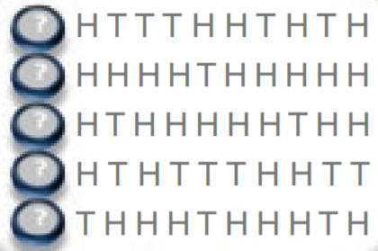
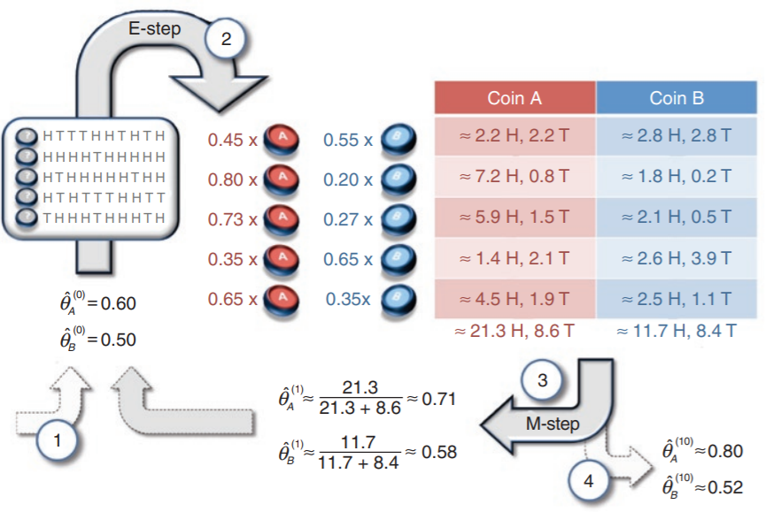

# EM 알고리즘

## EM 알고리즘 정의

 EM 알고리즘은 모수에 관한 추정값(⇒ **추정해야할 파라미터**)으로 log likelihood의 기댓값(⇒**관측을 통해 알 수 있음**)을 계산하는 기댓값 (E) 단계와 이 기댓값을 최대화하는 모수 추정값들을 구하는 최대화 (M) 단계를 번갈아가면서 적용한다. 최대화 단계에서 계산한 변수값은 다음 기댓값 단계의 추정값으로 쓰인다.

## 문제 예시

동전 A와 동전 B가 주어졌을때, 각 동전의 앞/뒤 면이 나올 확률를 구하고자 한다. 또한 두 동전 중 하나를 선택하여 10번씩 던지는데 이 과정을 5번 반복한다. 관찰값은 아래 사진과 값다.

### 

이때 어떤 동전이 선택되었는지를 모른 상태로 앞/뒤면이 나온 결과가 주어지므로, 각 차수에 어떤 동전이 선택되었는지를 추가로 추측해야한다. 이를 해결하기 위해 EM알고리즘을 사용해보도록 한다.

### EM 알고리즘을 이용한 문제 풀이

### 초기값 설정

 처음에는 모수 추정값인 동전 A의 앞면이 나올 확률 
$ \hat{\theta}^{0}_{A}$
과 동전 B의 앞면이 나올 확률
$\hat{\theta}^{0}_{B}$
에 랜덤으로 확률값을 넣어준다.

$$
\hat{\theta}^{0}_{A} = 0.6 \\
\hat{\theta}^{0}_{B} = 0.5
$$

### E-step

Hidden variable의 responsibility를 계산하는 단계

주어진 추정값(처음은 랜덤 한 값)을 사용하여 각 차수의 각 동전에 대해 앞/뒷면이 나올 확률을 구해본다. 1번 차수에서는 HTTTHHTHTH로 된 sequence (H=앞면, T=뒷면)가 데이터로 주어져 있으며 각 동전의 추정 값을 사용하여 이 sequence가 나올 확률을 구해본다.

- 동전 A를 사용했을 때 해당 sequence가 관찰될 확률 a
  $$
  a = 0.6^{5} * 0.4^{5} = 7.96e−05
  $$

- 동전 B를 사용했을 때 해당 sequence가 관찰될 확률 b
  $$
  b = 0.5^{5} * 0.5^{5} = 9.76e−05
  $$

- 1번 차수에서 동전 A 가 선택되었을 확률
  $$
  a / (a+b) = 0.45
  $$

- 1번 차수에서 동전 B 가 선택되었을 확률
  $$
  b / (a+b) = 0.55
  $$
  

### M-step

추정값 θ를 update 하는 단계

상태를 모르는 경우 (State Unknown)이므로, 모수 추정값을 확신할 수 없기에 E-step에서 계산한 responsibility를 사용하여 확률을 계산해준다.

이후 E-step, M-step을 차례로 반복하면 local maximum으로 답을 찾을 수 있다.

### 참고 자료

- [EM 알고리즘 위키](https://ko.wikipedia.org/wiki/%EA%B8%B0%EB%8C%93%EA%B0%92_%EC%B5%9C%EB%8C%80%ED%99%94_%EC%95%8C%EA%B3%A0%EB%A6%AC%EC%A6%98)

- https://modern-manual.tistory.com/46

