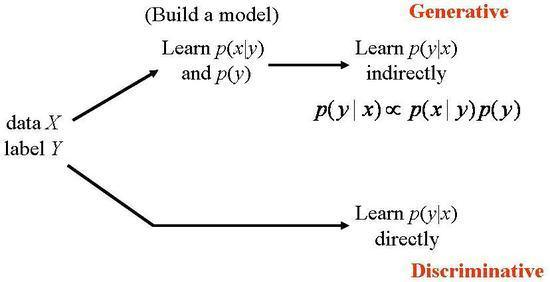
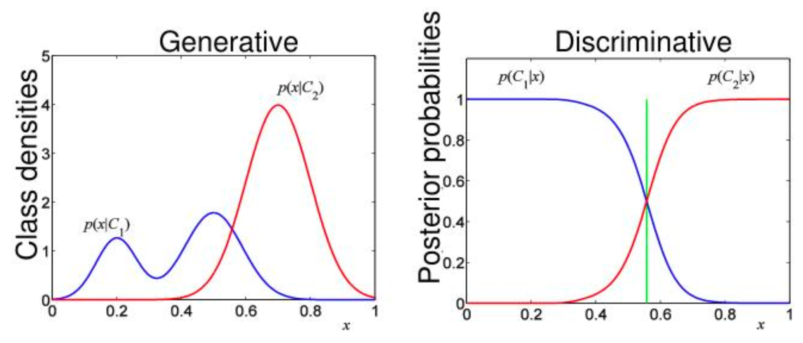
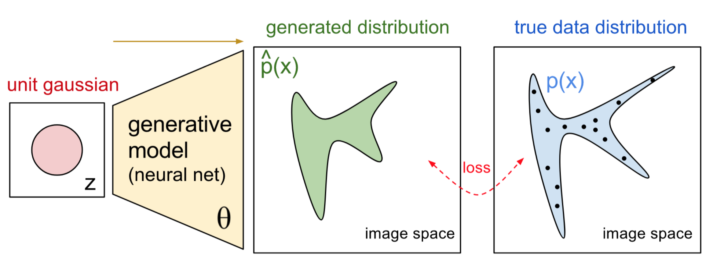

# Generative VS Discriminative model

# 개념 소개

두아이가 있었는데, A 아이는 모든것을 깊게 배우는 능력을 가졌고 B 아이는 자신이 본것들의 차이점만을 배우는 능력을 가졌다. 어느날, 이 아이들의 아버지가 아이들을 데리고 동물원에 데려가 사자와 코끼리를 보여주었다. 동물원에 나간 후 아버지는 두 아이들에게 한 동물의 사진을 보며주며 “이 동물이 사자인지 코끼리인지 맞춰봐" 라고 했다. A 아이는 자신이 본 사자와 코끼리를 각각 문제의 동물 사진과 비교해보며 가장 유사한 동물이름을 말한다. B 아이는 사자와 코끼리의 차이점을 이용하여 동물 이름을 말한다. 

이 두아이들은 사진의 동물을 찾으려고 하지만, 찾는 방법은 다르다. ML에서는 A 아이의 방법을 사용하는 모델은 generative model이라고 하고 B 아이의 방법을 사용하는 모델을 discriminative model이라고 한다.

일반적으로, discriminative model은 class 사이의 decision boundary를 이용하고, generative Model은 각각의 class의 actual distribution을 사용한다. generative 모델은 joint probability distribution p(x,y)을 학습

# discriminative model

- 데이터 X가 주어졌을 때 레이블 Y가 나타날 조건부확률 P(Y|X)를 직접적으로 반환하는 모델
- 레이블 정보가 있어야 하기때문에, supervised learning 범주에 속함
- X의 레이블을 잘 구분하는 decision boundary를 학습하는 것이 목표
- generative model보다 단순하며, 학습데이터 양이 충분하다면 좋은 성능을 내는것으로 알려져 있음

# generative model

- 데이터 X가 생성되는 과정을 두개의 확률 모형 P(Y), P(X|Y)으로 정의하고, Bayes rule을 이용해 P(Y|X)를 간접적으로 도출하는 모델
- 레이블 정보가 있어도 되고, 없어도 됨. supervised model 예로는 LDA가 대표적이고, unsupervised learning의 예로는 가우시안믹스처모델, LDA가 대표적

# Generative VS Discriminative model

generative model은 데이터 범주의 분포를, discriminative model은 결정경계를 학습한다.

## In Math

Training classifiers involve estimating f: X→ Y, or P(Y|X)

### Generative classifiers

- Assume some functional form for P(Y), P(X|Y)
- Estimate parameters of P(X|Y), P(Y) directly from training data
- Use Bayes rule to calculate P(Y|X)

### Discriminative classifiers

- Assume some functional form for P(Y|X)
- Estimate parameters of P(Y|X) directly from training data

## Examples

### Generative classifiers

- Naïve Bayes
- Bayesian networks
- Markov random fields
- Hidden Markov Models(HMM

### Discriminative Classifiers

- Logistic regression
- Scalar Vector machine
- Traditional neural networks
- Nearest neighbor
- Conditional Random Fields (CRF)s

# Deep Generative Model

- 딥러닝을 이용한 generative model.
- 데이터의 distribution을 학습하고, 이로부터 새로운 데이터 X를 생성하는 것이 목적.
- 딥러닝은 데이터의 분포를 모사하거나, 벡터 간 변환에 뛰어난 성능을 지니기 때문에 generative model에 딥러닝 기법을 이용
- Deep Generative Mode을 도식화한 그림은 아래와 같다.
  
    
    

## 참고 자료

- [https://medium.com/@mlengineer/generative-and-discriminative-models-af5637a66a3](https://medium.com/@mlengineer/generative-and-discriminative-models-af5637a66a3)
- [https://ratsgo.github.io/generative model/2017/12/17/compare/](https://ratsgo.github.io/generative%20model/2017/12/17/compare/)
