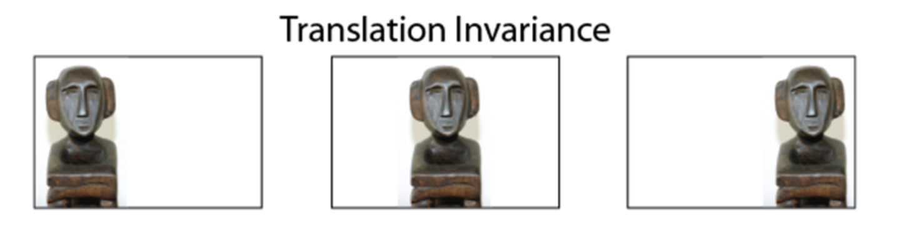
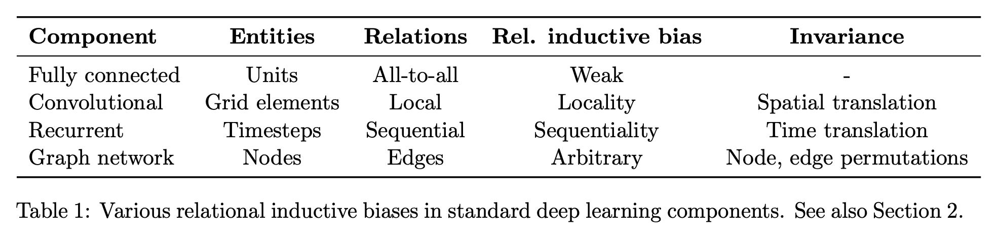
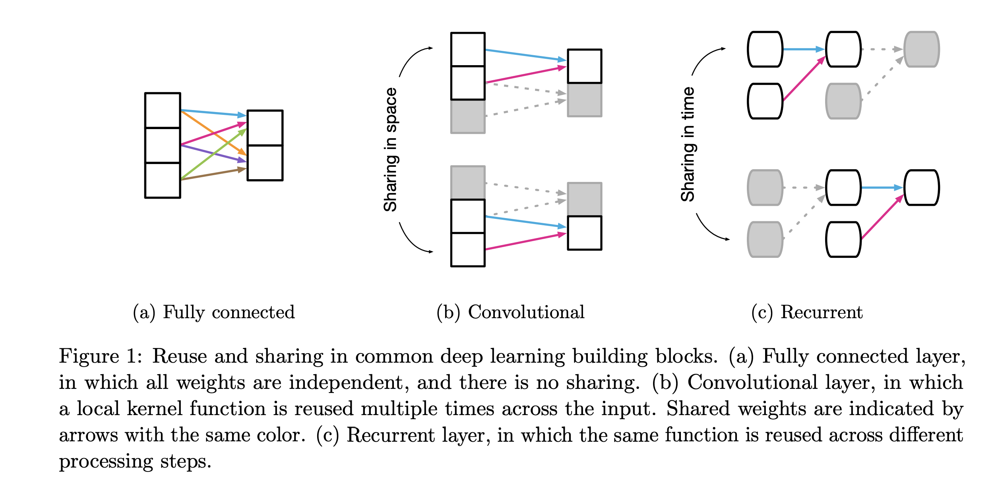

# Inductive Bias

[survey of transformers](https://arxiv.org/pdf/2106.04554.pdf)을 읽다가 Inductive Bias 용어를 정리하고자 한다.

## 머신러닝에서 Bias

- bias는 타켓과 예측값이 얼마나 멀리 떨어져 있는가를 나타냄. bais가 높으면 타켓과의 연관성을 잘 찾아내지 못한 것으로, underfitting 문제 발생
- variance는 예측값들이 얼마나 퍼져있는가를 나타냄. variance가 높으면 데이터의 사소한 노이즈나 예외적인 데이터에 민감하게 고려하는 것으로, overfitting 문제 발생
- bias를 학습 알고리즘의 잘못된 가정에 의하여 발생하는 오차라고도 한다. 아무튼 ML 모델은 아직 특정 도메인에 맞춰 개발되는 경우가 대부분임으로, 그 특정상황에 잘 맞는 일반적인 가정이 있다면 성능을 높일 수 있지 않을까?

## Inductive Bias

- 위키피디아 정의 : 학습 시에는 만나보지 않았던 상황에 대해, 정확한 예측을 하기 위해 사용하는 추가적인 가정

- 데이터의 특성에 맞게 적절한 Inductive Bias를 가지는 모델을 사용하면 좋은 성능을 냄

- CNN의 경우, Locality(근접 픽셀끼리 종속성), Transitional Invariance(사물 위치가 바뀌어도 동일 사물 인식)등의 특성을 가지기 때문에 이미지 데이터에 적합한 모델

  

  - 잘 학습된 모델이라면 위치는 각각 다르지만, 같은 그림으로 인식.

- 한 논문에서는 inductive bias를 아래와 같이 서술한다.

  - While not a precise, formal definition, we use this term to refer generally to inductive biases (Box 2) which impose **constraints on relationships and interactions among entities in a learning process.**

  - 또한, 각 Component의 inductive bias와 invariance를 아래표와 같이 묘사한다.

    

  - 그리고 각 Component를 아래와 같이 도식화하고, reusing & sharing 가능한 block 단위로 나누었을 때 이를 여러 공간(space),  시간(time), 노드(node)에서 사용이 가능하면 invariance라고 한다.

    

    - 용어(invariance)의  의미
    
      이 용어(invariance)의 사용 이유를 추측하기에는 어려운데, 아마 공간, 시간, 노드 내에서 같은 입력이 들어오면 같은 결과를 내뱉으므로 invariance라는 용어를 쓴것이 아닐까..? 아니면 관계를 설명할 수 있는 가장 작은 단위이므로..?
    
      **좀 더 정리하자면, 공간, 시간, 노드가 다르더라도 같다고 인식하는 것을 invariance라고 보면 좋을거 같다.** → 위 Translation invariance 예제 그림처럼

    - Convolutional : Translation invariance reflects reuse of the same rule across localities in the input.
    - Recurrent : The rule is reused over each step (Figure 1c), which reflects the relational inductive bias of temporal invariance (similar to a CNN’s translational invariance in space).

## 참고자료

- [https://re-code-cord.tistory.com/entry/Inductive-Bias란-무엇일까](https://re-code-cord.tistory.com/entry/Inductive-Bias%EB%9E%80-%EB%AC%B4%EC%97%87%EC%9D%BC%EA%B9%8C)
- [https://dacon.io/en/forum/405840](https://dacon.io/en/forum/405840)
- [https://ruder.io/emnlp-2018-highlights/](https://ruder.io/emnlp-2018-highlights/)
- [https://arxiv.org/pdf/1806.01261.pdf](
