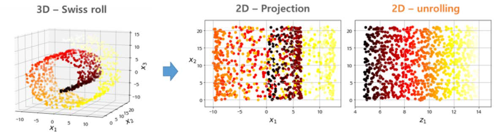
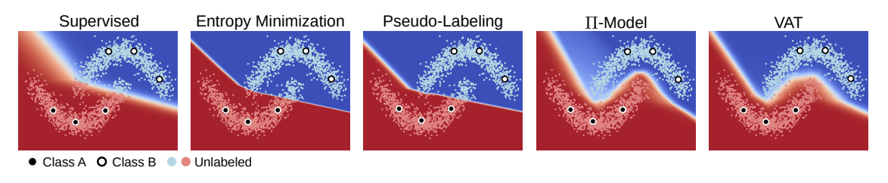
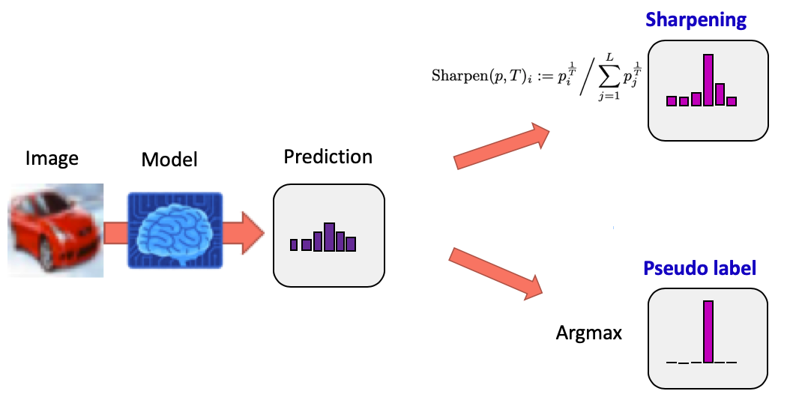
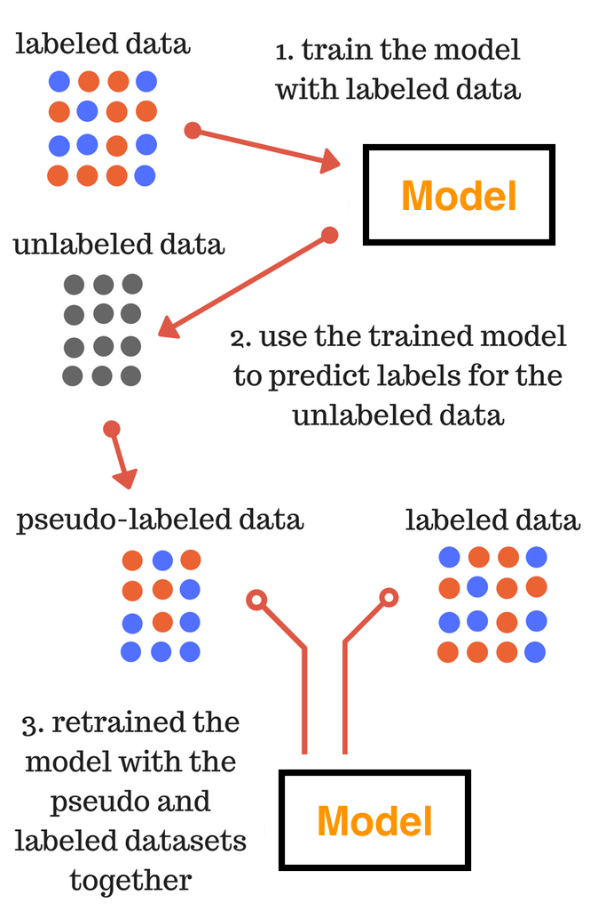
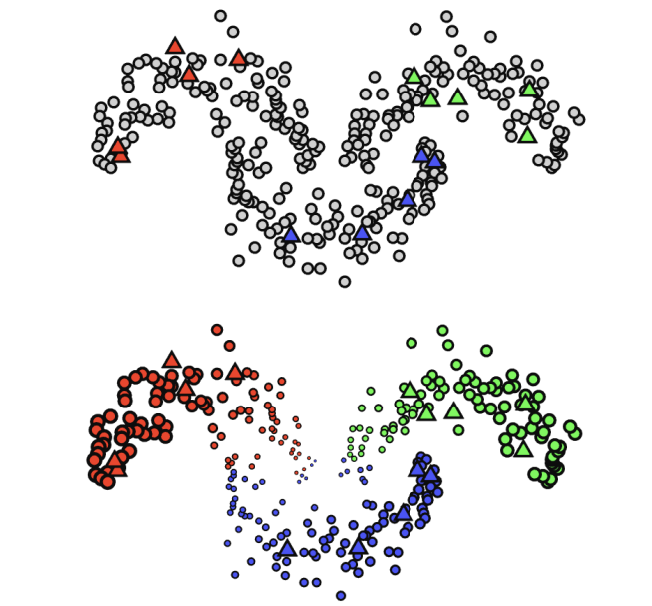

# semi-supervised learning (준지도학습)

## Semi-supervised learning이란

- 소량의 labeled data에는 supervised learning을 적용하고, 대용량 unlabeled data에는 unsupervised learning을 적용해 추가적으로 성능향상을 목표로 하는 방법론

- 이런 방법론의 주장은 label을 맞추는 모델에서 벗어나 데이터 자체의 본질적인 특성이 모델링된다면, 소량의 labeled data를 통한 약간의 가이드로 일반화 성능을 끌어올릴 수 있다는 것.

- Semi-supervised learning의 목적함수는 supervised loss $L_s$와 unsupervised loss $L_u$의 합을 최소화하는 것으로 표현. 즉, supervised와 unsupervised를 1-stage로 햔큐에 학습. 2-stage로 이루어지는 self-supervised learning과 transfer learning과는 다른 학습 방식.

  $$
  Loss = L_s + L_u
  $$

## Semi-supervised learning의 가정

### The smoothness assumption

**만약 데이터 포인트 $x_1$과 $x_2$가 고밀도 지역에서 가까이 위치한다면, 해당하는 출력 $y_1$과  $y_2$도 가까워야 한다.** 이는 같은 class에 속하고 같은 cluster인 두 입력이 고밀도 지역에서 가까이 위치한다면, 해당하는 출력도 가까워야한다는 것을 의미. 반대로 멀리 위치한다면, 해당하는 출력도 역시 멀어야한다. 이러한 가정은 classification엔 도움이 되는 가정이지만, regression에선 도움이 되지 않을 수 있다.

### The cluster assumption

**만약 데이터 포인트들이 같은 cluster에 있다면 같은 cluster에 있다면, 그들은 같은 class일 것이다.** 이 가정이 성립한다면 하나의 cluster는 하나의 class를 나타낼 것이고, 이를 통해 decision boundary는 저밀도 지역을 통과해야만 한다고 말할 수 있다.

### The manifold assumption

**고차원의 데이터를 저차원 manifold로 보낼 수 있다.** 고차원의 공간상에서 generative task를 위한 진짜 data distribution을 추정하기는 어렵다. 또한 discriminative task에서도 고차원에서는 class간의 distance가 거의 유사하기에 classification이 어렵다. 그러나 만약 data를 더 낮은 차원으로 보낼 수 있다면, unlabeled data를 사용해서 저차원 표현을 얻을 수 있고 labeled data를 사용해 더 간단한 task를 풀 수 있다.

이때 manifold란 고차원의 데이터를 공간에 뿌릴 때 샘플들을 잘 아우를 수 있는 subspace를 의미. manifold learning을 하게 되면 고차원의 데이터를 잘 표현할 수 있는 manifold의  특성을 알게되고, 이를 통해 샘플 데이터의 특징을 파악할 수 있고 차원을 축소해 볼 수 있음 (⇒ 예측 모델의 성능 증대 기대) 아래 사진은 롤링이 되어 있다는 것을 모르고 정사시킨 것과 알고 펼친 것의 차이이다.

## Semi-supervised learning 방법론들

### Entropy minimization

- Entropy minimization는 ‘decision boundary는 데이터의 저밀도 지역에서 형성될 것'이라는 가정에 기초해서 unlabeled data output의 entropy를 minimization 하는 기법

- 예를 들어 개와 고양이를 분류하려고 할때, 개 0.6 고양이 0.4가 나오는 것보다 개 0.9 고양이 0.1이 나오는 것이 entropy가 더 낮고 이런 방법으로 학습이 되어야 한다는 것. (=decision boundary 근처에 있는 애매한 애들을 확실하게 구별할 수 있도록)

- 이 방법은 단일기법으로 사용했을때는 성능이 그리 좋지 못하지만, 다른 방법들과 같이 사용할 때 효과가 좋다. 예를 들면 MixMatch, UDA, ReMixMatch는 temperature sharpening을 통해 entropy minimization을 간접적으로 사용하고, FixMatch의 경우 pseudo-label을 이용하기 때문에 이또한 간접적 entropy minimization이다. pseudo-label은 왜 entropy minimization이냐 라고 할 수 있는데, pseudo-label을 달 때 argmax를 통해 one-hot vector로 mapping 시키는 과정이 들어가기 때문이다.

  

### Proxy-label method

- Proxy-label 기법은 labeled set으로 학습된 모델을 이용해 unlabeled data point들에 label을 달아주는 기법.

  

- 간단한 기법으로 classification, regression에 모두 사용할 수 있다는 장점 존재

- 만약 labeled set이 분포를 벗어나는 샘플들에 대해서는 제대로된 label을 달아주기 어렵기때문에 성능향상에 한계가 있다는 단점 존재

- 여러 변형 존재. pseudo-label의 confidence가 높은 샘플들만 이용해 성능을 향상시키는 여러 논문도 존재하고 (confidence를 측정할 수 있는 uncertainty 모델링 등) pseudo-label set을 점점 늘려간다던가, 더 큰 모델을 사용한다던가 다양한 방법으로 고도화 가능. 유명한 모델로는 self-training (pseudo-label, meta pseudo-label, noisy student), multi-view training (Co-training) 존재

### Generative models

- Generative model은 label이 없이도 원본 데이터를 생성(복원)할 수 있는 feature를 뽑아내는 reconstruction task 수행
- reconstruction task 역시 label이 없이 입력만 있다면 수행할 수 있기 때문에, semi-supervised learning에서 unlabeled data에 주는 unsupervised task로 적합
- 가장 유명한 모델으로는 Π-model, Temporal Ensemble, Mean Teacher, Virtual Adversarial Training (VAT), unsupervised data augmentation (UDA)
- 이미지 외 도메인에서는 해당 도메인 지식없이는 제대로된 data augmentation을 적용하기 어려워 적용에 한계 존재

### Graph-based methods

- unlabeled data의 label을 알고싶다는 것에서 출발하여, 이는 앞선 방법들이 unlabeled data로 labeled data의 예측 성능을 올리고 싶다는 것과 다른 목표를 가짐

- 대표적인 방법으로 graph의 노드로 {labeled, unlabeled} 데이터를 표현하고 노드들 사이의 유사도를 기준으로 유사도 가중치가 높은 이웃으로 건너 건너 label을 추정하는 label propagation이 있다

  

## 참고 자료

[https://sanghyu.tistory.com/177](https://sanghyu.tistory.com/177)

[https://wpaud16.tistory.com/139](
