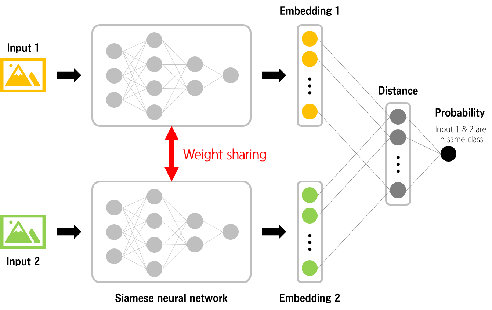
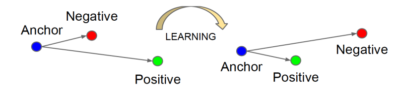
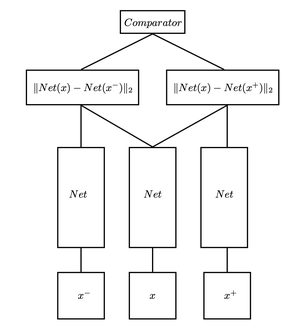

# Siamese/Triplet Network

## Siamese Network

### Siamese Network

A **Siamese neural network** (sometimes called a **twin neural network**) is an artificial neural network that uses **the same weights** while working in tandem on two different input vectors to compute comparable output vectors.

즉 siamese network는 구조가 같으며, weight를 공유한다. 어차피 weight를 공유하기에, 한 네트워크락 봐도 무방한다.

### 학습 방법

1. 두 입력 데이터(input1, input2)를 준비.
2. 각 입력에 대한 임베딩 값(Embeddig1, Embedding2)을 얻음.
3. 두 임베딩 사이의 거리 계산.  L1 norm, L2 norm 등의 방법을 사용.
4. 두 입력이 같은 클래스에 속한다면 거기를 가깝게, 다른 클래스에 속한다면 거리를 멀게 Siamese neural network를 학습.

## Triplet Network

### Triplet Network

Triplet Network는 기준 데이터로부터 근사한 데이터는 가깝게, 근사하지 않은 데이터는 멀리 떨어뜨려서 적절한 분리 공간에 배치하도록 하기 위해 만들어진 network.

triplet network는 기준이 되는 데이터와 이를 비교할 두개의 데이터(positive and negative data)를 입력으로 넣어 학습된다.

### triplet loss

Triplet Loss는 타겟이 되는 데이터(Anchor), 동일 클래스의 데이터(Positive), 다른 클래스의 데이터(Negative) 간의 distance를 계산하기 위한 loss function이다.

## 참고자료

- https://velog.io/@jaehyeong/Paper-Review-Sentence-BERT-Sentence-Embedding-using-Siamese-BERT-Networks
- https://tyami.github.io/deep%20learning/Siamese-neural-networks/
- https://m.blog.naver.com/4u_olion/221478534498
- https://en.wikipedia.org/wiki/Triplet_loss

